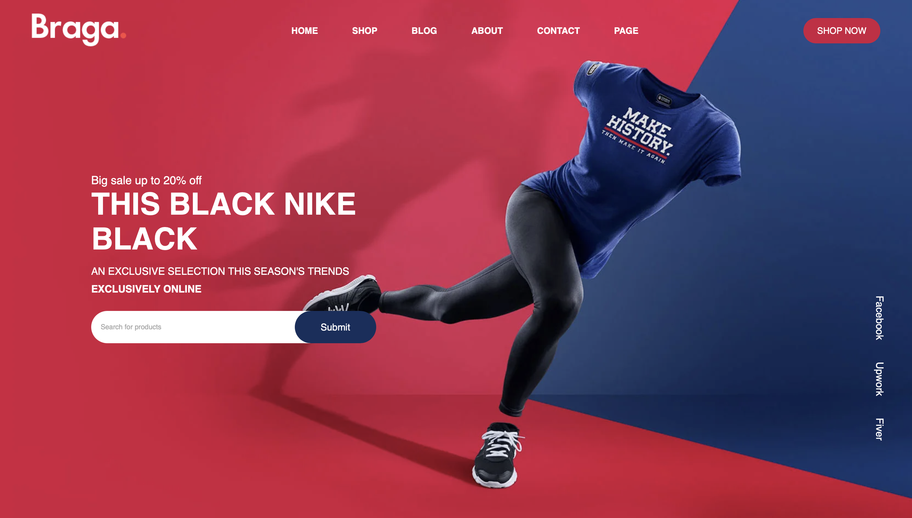
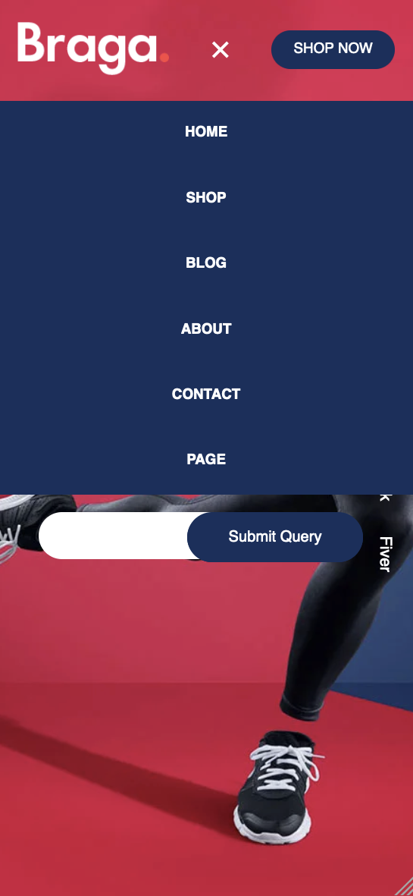

# Braga Shop

Braga Shop is a stylish and modern e-commerce website template designed to showcase and sell products online. It features a responsive layout, intuitive navigation, and a clean design that highlights your product offerings. The website is built using HTML, CSS, and JavaScript.

## Table of Contents

- [Features](#features)
- [Technologies Used](#technologies-used)
- [Getting Started](#getting-started)
- [File Structure](#file-structure)
- [Customization](#customization)
- [Screenshots](#screenshots)
- [Contributing](#contributing)
- [Contact Information](#contact-information)

## Features

- Responsive design for all devices
- Fixed header with navigation menu
- Stylish product search bar
- Social media links
- Smooth scrolling behavior
- Mobile-friendly navigation menu

## Technologies Used

- HTML
- CSS
- JavaScript
- Boxicons (for icons)

## Getting Started

### Prerequisites

To view and edit this project, you'll need:

- A web browser (e.g., Chrome, Firefox, Safari)
- A text editor or IDE (e.g., VS Code, Sublime Text)

### Installation

1. Clone the repository:

    ```sh
    git clone https://github.com/chouaib-629/e-commerce_design_bragaShop.git
    ```

2. Navigate to the project directory:

    ```sh
    cd e-commerce_design_bragaShop
    ```

### Usage

1. Open `index.html` in your web browser to view the website.
2. To make changes, open the project files in your text editor.

## File Structure

- `index.html` - Main HTML file containing the website structure.
- `style.css` - CSS file for styling the website.
- `script.js` - JavaScript file for interactive functionality.
- `images/` - Directory containing image assets.

## Customization

### Logo

Replace the logo image in the `images` directory with your own logo and update the `` tag in the `header` section of `index.html`:

```html
<a href="#" class="logo">
    
</a>
```

### Background Image

Replace the background image in the `images` directory with your own image and update the `background-image` property in `style.css`:

```css
body {
    background-image: url(images/slider.jpg);
    background-position: center;
    background-size: cover;
}
```

### Social Media Links

Update the social media links in the `.right` div of `index.html`:

```html
<div class="right">
    <a href="#">Facebook</a>
    <a href="#">Upwork</a>
    <a href="#">Fiverr</a>
</div>
```

## Screenshots

Here are some screenshots of the website:

### Landing Page



### Landing Page For Mobile


### Navigation Bar on Mobile



## Contributing

We welcome contributions! Please follow these steps:

1. Fork the repository.
2. Create a new branch (`git checkout -b feature-branch`).
3. Commit your changes (`git commit -m 'Add new feature'`).
4. Push to the branch (`git push origin feature-branch`).
5. Open a Pull Request.

## Contact Information

For questions or support, please contact [Me](mailto:chouaiba629@gmail.com)